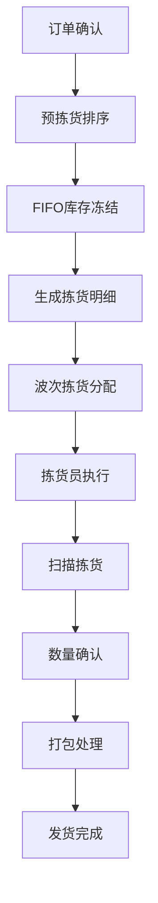

# 🔄 拣货操作指南

本指南详细介绍仓库管理系统的拣货操作流程，包括拣货单生成、执行和完成等环节。

## 📋 拣货流程概览

### 完整拣货流程

```
1. 订单确认 → 2. 预拣货排序 → 3. 生成拣货明细 → 4. 波次分配 → 5. 拣货执行 → 6. 打包发货
```

### 详细流程图



## 🎯 第一阶段：预拣货排序

### 1.1 触发条件

- 订单状态：已确认 (`STATUS_CONF`)
- 库存检查：所有SKU库存充足
- 系统检查：无重复处理

### 1.2 操作示例

```php
// 执行预拣货排序
$orderService = new OrderService();
$result = $orderService->performPrePickSorting('SO202412150001', true);

if ($result['success']) {
    echo "预拣货成功，生成明细数量：" . $result['details_count'];
    echo "冻结库存总量：" . $result['total_frozen'];
} else {
    echo "预拣货失败：" . $result['message'];
}
```

### 1.3 FIFO库存冻结原理

系统按照**先进先出（FIFO）**原则自动选择库存批次进行冻结：

```php
// 查看FIFO库存分配情况
$details = SalesPickingDetail::find()
    ->where(['order_no' => 'SO202412150001'])
    ->orderBy('location_code ASC, received_at ASC')
    ->all();

foreach ($details as $detail) {
    echo "SKU: {$detail->product_sku}, 库位: {$detail->location_code}, ";
    echo "冻结数量: {$detail->qty_demand}, 批次入库时间: {$detail->received_at}";
}
```

## 🌊 第二阶段：波次拣货分配

### 2.1 波次策略

系统支持多种波次策略，可根据业务需求选择：

#### 按时间策略 (TIME)
```php
$waveService = new WavePickingService();
$result = $waveService->generateWavePickingBatch([
    'strategy' => WavePickingService::STRATEGY_TIME,
    'warehouse_code' => 'WH01',
    'max_orders' => 20,        // 每波次最大订单数
    'max_items' => 100,        // 每波次最大商品数
    'time_range' => 60         // 时间范围（分钟）
], [
    'picker' => 'picker001',   // 指定拣货员
    'optimize_path' => true    // 开启路径优化
]);
```

#### 按库位策略 (LOCATION)
```php
$result = $waveService->generateWavePickingBatch([
    'strategy' => WavePickingService::STRATEGY_LOCATION,
    'warehouse_code' => 'WH01',
    'location_groups' => ['A区', 'B区'],  // 库位分组
    'max_orders' => 15
], [
    'picker' => 'picker002',
    'optimize_path' => true
]);
```

#### 按客户策略 (CUSTOMER)
```php
$result = $waveService->generateWavePickingBatch([
    'strategy' => WavePickingService::STRATEGY_CUSTOMER,
    'warehouse_code' => 'WH01',
    'customer_priority' => ['CUST001', 'CUST002'],  // 客户优先级
    'max_orders' => 10
], [
    'picker' => 'picker003',
    'optimize_path' => true
]);
```

### 2.2 手动分配明细

对于特殊情况，可以手动将拣货明细分配到指定拣货单：

```php
// 查找待分配的明细
$pendingDetails = SalesPickingDetail::find()
    ->where(['picking_no' => null, 'status' => 'waiting'])
    ->andWhere(['warehouse_code' => 'WH01'])
    ->limit(10)
    ->all();

$detailIds = array_map(function($detail) {
    return $detail->id;
}, $pendingDetails);

// 手动分配到指定拣货单
$assignResult = $waveService->assignDetailsToPickingManually(
    $detailIds,
    'WWH0120241215000001'  // 拣货单号
);

if ($assignResult['success']) {
    echo "成功分配 {$assignResult['assigned_count']} 个明细";
} else {
    echo "分配失败：{$assignResult['message']}";
}
```

### 2.3 拣货路径优化

系统自动按库位编码排序，优化拣货路径：

```php
// 查看优化后的拣货路径
$optimizedDetails = SalesPickingDetail::find()
    ->where(['picking_no' => 'WWH0120241215000001'])
    ->orderBy('location_code ASC')
    ->all();

echo "优化后的拣货路径：\n";
foreach ($optimizedDetails as $index => $detail) {
    echo ($index + 1) . ". 库位：{$detail->location_code} ";
    echo "商品：{$detail->product_sku} ";
    echo "数量：{$detail->qty_demand}\n";
}
```

## 📦 第三阶段：拣货执行

### 3.1 开始拣货

拣货员开始执行拣货任务：

```php
$pickingService = new PickingService();

// 开始拣货
$result = $pickingService->startPicking('WWH0120241215000001', 'picker001');

if ($result['success']) {
    echo "拣货开始，拣货单状态更新为：doing";
    echo "预计拣货时间：{$result['estimated_duration']} 分钟";
} else {
    echo "开始拣货失败：{$result['message']}";
}
```

### 3.2 扫描拣货

拣货员按照路径扫描商品进行拣货：

```php
// 扫描拣货 - 支持批次验证
$scanResult = $pickingService->scanAndPick(
    'WWH0120241215000001',  // 拣货单号
    'SKU001',               // 商品SKU
    10,                     // 拣货数量
    'BATCH20241201001',     // 批次号（可选）
    'LOC-A-01-01'          // 库位编码（可选）
);

if ($scanResult['success']) {
    echo "拣货成功！";
    echo "当前进度：{$scanResult['progress']}%";
    echo "剩余数量：{$scanResult['remaining_qty']}";
} else {
    echo "拣货失败：{$scanResult['message']}";
}
```

### 3.3 处理异常情况

#### 3.3.1 库存不足处理

```php
// 当库存不足时，可以部分拣货
$partialResult = $pickingService->scanAndPick(
    'WWH0120241215000001',
    'SKU002',
    20,                     // 需求数量
    null,                   // 自动选择批次
    null,                   // 自动选择库位
    true                    // 允许部分拣货
);

if ($partialResult['partial']) {
    echo "部分拣货：实际拣货 {$partialResult['actual_qty']} 件";
    echo "缺货数量：{$partialResult['shortage_qty']} 件";
}
```

#### 3.3.2 异常SKU处理

```php
// 暂停异常明细
$suspendResult = $pickingService->suspendPickingDetail(
    $detailId,
    '商品破损，需要重新调配库存'
);

// 查看暂停的明细
$suspendedDetails = SalesPickingDetail::find()
    ->where(['picking_no' => 'WWH0120241215000001', 'status' => 'paused'])
    ->all();
```

### 3.4 完成拣货

```php
// 完成拣货单
$completeResult = $pickingService->completePicking('WWH0120241215000001');

if ($completeResult['success']) {
    echo "拣货完成！";
    echo "总计拣货：{$completeResult['total_picked']} 件";
    echo "完成率：{$completeResult['completion_rate']}%";
    echo "拣货用时：{$completeResult['duration']} 分钟";
} else {
    echo "完成拣货失败：{$completeResult['message']}";
}
```

## 📊 拣货监控和统计

### 4.1 拣货进度查询

```php
// 查询拣货单进度
$picking = SalesPicking::findOne(['picking_no' => 'WWH0120241215000001']);
$progress = $picking->getPickingProgress();

echo "拣货进度：{$progress['completion_rate']}%\n";
echo "已拣商品种数：{$progress['picked_products']}/{$progress['total_products']}\n";
echo "已拣数量：{$progress['picked_quantity']}/{$progress['total_quantity']}\n";
```

### 4.2 拣货员效率统计

```php
// 查询拣货员今日效率
$todayStats = $pickingService->getPickerDailyStats('picker001', date('Y-m-d'));

echo "今日拣货统计：\n";
echo "完成拣货单：{$todayStats['completed_pickings']} 张\n";
echo "拣货商品数：{$todayStats['total_items']} 件\n";
echo "平均每单用时：{$todayStats['avg_duration']} 分钟\n";
echo "拣货效率：{$todayStats['efficiency_score']} 分\n";
```

### 4.3 异常情况监控

```php
// 查询异常明细
$exceptionDetails = SalesPickingDetail::find()
    ->where(['status' => ['paused', 'canceled']])
    ->andWhere(['between', 'created_at', date('Y-m-d 00:00:00'), date('Y-m-d 23:59:59')])
    ->all();

echo "今日异常明细：{count($exceptionDetails)} 条\n";
foreach ($exceptionDetails as $detail) {
    echo "订单：{$detail->order_no}, SKU：{$detail->product_sku}, ";
    echo "状态：{$detail->status}, 备注：{$detail->remark}\n";
}
```

## 🎛️ 拣货配置管理

### 5.1 拣货参数配置

```php
// 设置拣货配置
$pickingConfig = [
    'enable_batch_validation' => true,      // 启用批次验证
    'enable_location_validation' => true,   // 启用库位验证
    'allow_partial_picking' => true,        // 允许部分拣货
    'auto_complete_threshold' => 0.95,      // 自动完成阈值
    'max_picking_duration' => 120,          // 最大拣货时间（分钟）
    'path_optimization' => true,            // 启用路径优化
];

$pickingService->setPickingConfig($pickingConfig, 'WH01');
```

### 5.2 波次策略配置

```php
// 配置波次策略参数
$waveConfig = [
    'time_strategy' => [
        'peak_hours' => ['09:00-11:00', '14:00-16:00'],  // 高峰时段
        'max_orders_peak' => 15,                         // 高峰期最大订单数
        'max_orders_normal' => 25,                       // 正常时段最大订单数
    ],
    'location_strategy' => [
        'zone_priorities' => ['A' => 1, 'B' => 2, 'C' => 3],  // 库区优先级
        'cross_zone_penalty' => 0.2,                          // 跨库区惩罚因子
    ],
    'customer_strategy' => [
        'vip_customers' => ['CUST001', 'CUST002'],       // VIP客户
        'vip_priority_boost' => 2,                       // VIP优先级提升
    ]
];

$waveService->setWaveConfig($waveConfig, 'WH01');
```

## 🔧 故障排除

### 6.1 常见问题

#### 问题1：拣货明细分配失败

**现象**：波次分配时提示"无可分配明细"

**排查步骤**：
```php
// 1. 检查待分配明细数量
$pendingCount = SalesPickingDetail::find()
    ->where(['picking_no' => null, 'status' => 'waiting'])
    ->count();
echo "待分配明细数量：{$pendingCount}\n";

// 2. 检查仓库配置
$warehouseConfig = $waveService->getWarehouseConfig('WH01');
var_dump($warehouseConfig);

// 3. 检查拣货员状态
$pickerStatus = $pickingService->getPickerStatus('picker001');
echo "拣货员状态：{$pickerStatus['status']}\n";
```

#### 问题2：拣货进度不更新

**现象**：扫描拣货后进度不变

**排查步骤**：
```php
// 1. 检查Redis连接
$redis = Yii::$app->redis;
echo "Redis连接状态：" . ($redis->ping() ? "正常" : "异常") . "\n";

// 2. 检查缓存键
$cacheKey = "picking_progress:WWH0120241215000001";
$cachedProgress = $redis->get($cacheKey);
echo "缓存进度：{$cachedProgress}\n";

// 3. 强制刷新进度
$picking = SalesPicking::findOne(['picking_no' => 'WWH0120241215000001']);
$freshProgress = $picking->refreshProgress();
echo "刷新后进度：{$freshProgress}%\n";
```

### 6.2 性能优化建议

1. **批量操作优化**
   ```php
   // 批量更新明细状态，减少数据库操作
   SalesPickingDetail::updateAll(
       ['status' => 'picked'],
       ['id' => [1, 2, 3, 4, 5]]
   );
   ```

2. **索引优化**
   ```sql
   -- 添加拣货查询索引
   CREATE INDEX idx_picking_status_location ON ky_sales_picking_detail 
   (picking_no, status, location_code);
   ```

3. **缓存策略**
   ```php
   // 缓存热点数据
   $cacheKey = "warehouse_locations:WH01";
   $locations = $redis->get($cacheKey);
   if (!$locations) {
       $locations = Location::find()->where(['warehouse_code' => 'WH01'])->all();
       $redis->setex($cacheKey, 3600, serialize($locations));
   }
   ```

## 📈 KPI 指标监控

### 7.1 拣货效率指标

```php
// 计算拣货效率KPI
$kpiService = new PickingKpiService();

// 按日统计
$dailyKpi = $kpiService->getDailyKpi('WH01', date('Y-m-d'));
echo "日拣货效率：{$dailyKpi['picks_per_hour']} 件/小时\n";
echo "日完成率：{$dailyKpi['completion_rate']}%\n";
echo "日准确率：{$dailyKpi['accuracy_rate']}%\n";

// 按拣货员统计
$pickerKpi = $kpiService->getPickerKpi('picker001', date('Y-m-d'));
echo "拣货员效率：{$pickerKpi['efficiency_score']} 分\n";
```

### 7.2 异常分析

```php
// 异常情况分析
$exceptionAnalysis = $kpiService->getExceptionAnalysis('WH01', date('Y-m-d'));

echo "异常类型分布：\n";
foreach ($exceptionAnalysis['exception_types'] as $type => $count) {
    echo "- {$type}: {$count} 次\n";
}

echo "热点异常SKU：\n";
foreach ($exceptionAnalysis['hot_exception_skus'] as $sku => $count) {
    echo "- {$sku}: {$count} 次\n";
}
```

---

*最后更新：2024年12月15日* 